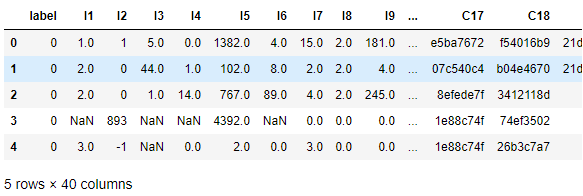
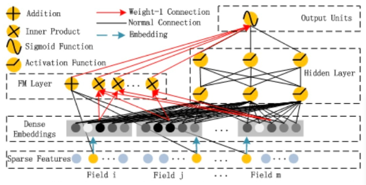
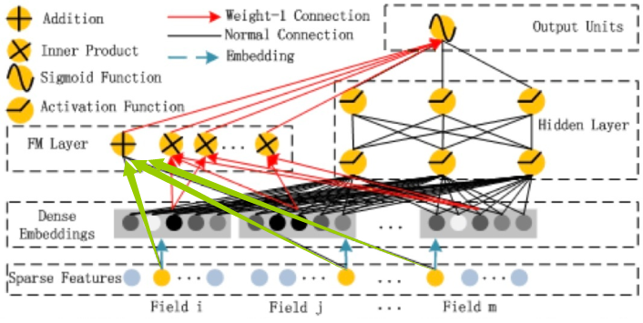
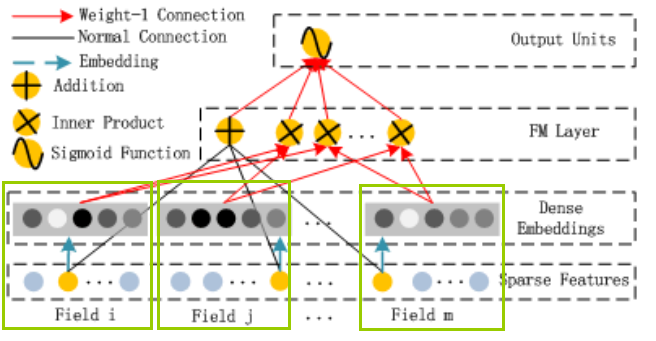
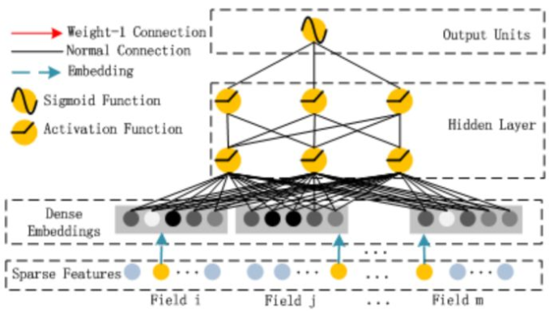

# 【CTR模型】TensorFlow2.0 的 DeepFM 实现与实战(附代码+数据)
tensorflow2.0 实现的 DeepFM，使用 Criteo 子数据集加以实践。

本文 CSDN 链接：https://blog.csdn.net/VariableX/article/details/107643912

本篇文章讲解 DeepFM 的 tensorflow2.0 实现，并使用 Criteo 数据集的子集加以实践。如果在看本文时有所困惑，可以看看DeepFM的相关理论： [CTR深度学习模型之 DeepFM 模型解读](https://blog.csdn.net/VariableX/article/details/107548080) 。

本文使用的数据下载地址于代码获取地址在文末获取。

首先了解一下 Criteo数据集，它由有39个特征，1个label列，其中以I开头的为数值型特征，以C开头的为类别特征：



可以看到数据中有缺失值需要填充，并且类别变量需要进行类别编码(onehot 编码的任务交给模型)，这部分预处理的代码不详细讲了。

而下面这张图是 DeepFM 的网络结构：



## FM 部分

### 一阶特征

要构建立此模型，第一步是要构造模型的输入并且对各个输入进行加权求和，如下图绿色箭头所示：



在 CTR 任务中，数据主要分为两个类型，一种是数值型的连续变量(Dense type)，另一种是类别型的离散数(Sparse type)。为了更方便的构造模型的输入，我们先提取出不同类型的特征：

```python
# 数值型
dense_feats = [f for f in cols if f[0] == "I"]
# 类别型
sparse_feats = [f for f in cols if f[0] == "C"]
```

对于数值型特征，构造其模型输入与加权求和的代码如下：

```python
# 构造每个 dense 特征的输入
dense_inputs = []
for f in dense_feats:
    _input = Input([1], name=f)
    dense_inputs.append(_input)
# 将输入拼接到一起，方便连接 Dense 层
concat_dense_inputs = Concatenate(axis=1)(dense_inputs)  # ?, 13
# 然后连上输出为1个单元的全连接层，表示对 dense 变量的加权求和
fst_order_dense_layer = Dense(1)(concat_dense_inputs)  # ?, 1
```

上面代码的注释中 ？ 表示输入数据的 batch_size。

对于每一个 sparse 特征，一般都是进行one-hot以后再转化为embedding特征，但实际上由于稀疏性的存在，很多位置的 $x_i$ 取0时，对应的 $w_i x_i$  也为0。因此，可以将 sparse 特征 embedding 到 1维，然后通过 embedding lookup 的方式来找到对应的 $w_i$ 。

这里举个例子：假设我们的性别特征取值有-1，0，1三种，某个样本的取值为1，则其one-hot以后为[0, 0, 1]向量，我们进行线性回归时会得到 $w_1 \times 0 + w_2 \times 0 +w_3 \times 1$ ，仅仅只有 $w_3$ 被保留下来。因此，可以对性别构造一个 3*1 的 embedding 向量，然后通过 embedding  lookup 得到系数。

相关 embedding 与加权求和的代码如下：

```python
sparse_1d_embed = []
for feat in sparse_feats:
    ipt = Input(shape=(1, ))
    voc_size = total_data[feat].nunique()
    # 使用 l2 正则化防止过拟合
    reg = tf.keras.regularizers.l2(0.5)
    embed = Embedding(input_dim=voc_size, output_dim=1, embeddings_regularizer=reg)(ipt)
    # 由于 Embedding 的结果是二维的，
    # 因此如果需要在 Embedding 之后加入 Dense 层，则需要先连接上 Flatten 层
    embed = Flatten()(embed)
    sparse_1d_embed.append(embed)
# 对每个 embedding lookup 的结果 wi 求和
fst_order_sparse_layer = Add()(sparse_1d_embed)
```

到这里为止，分别完成了对 Dense 特征与 Sparse 特征的加权求和，接下来就是将二者的结果再求和：

```python
linear_part = Add()([fst_order_dense_layer, fst_order_sparse_layer])
```

到这里，上图中绿色箭头表示的加权求和的功能就实现了。

### 二阶特征组合

对于 FM 模块而言，在进行特征组合之前，每个 sparse 特征需要先进行 embedding，如下图中绿色方框所示：



相关代码如下：

```python
# embedding size
k = 8

# 只考虑sparse的二阶交叉
sparse_kd_embed = []
for i, _input in enumerate(sparse_inputs):
    f = sparse_feats[i]
    voc_size = total_data[f].nunique()
    reg = tf.keras.regularizers.l2(0.7)
    _embed = Embedding(voc_size, k, embeddings_regularizer=reg)(_input)
    sparse_kd_embed.append(_embed)
```

接下来就是要进行特征组合，如果对 n 个 sparse 特征两两组合，那么复杂度应该是 $O(n^2)$ ，但是可以对特征组合的公式加以化简：
$$
\begin{aligned}  & \sum_{i=1}^n{\sum_{j=i+1}^n{<v_i,v_j>x_ix_j}} \\ & = \frac{1}{2}\sum_{i=1}^n{\sum_{j=1}^n{<v_i,v_j>x_ix_j}}-\frac{1}{2}\sum_{i=1}^n{<v_i,v_i>x_ix_i}\\  & = \frac{1}{2}\left(\sum_{i=1}^n{\sum_{j=1}^n{\sum_{f=1}^k{v_{if}v_{jf}x_ix_j}}}-\sum_{i=1}^n{\sum_{f=1}^k{v_{if}v_{if}x_ix_i}}\right) \\   & = \frac{1}{2}\left(\sum_{f=1}^k{\sum_{i=1}^n{v_{if}x_i\sum_{j=1}^n{v_{jf}x_j}}}-\sum_{i=1}^n{\sum_{f=1}^k{v_{if}v_{if}x_ix_i}}\right) \\
&= \frac{1}{2}\sum_{f=1}^k\left(\left(\sum_{i=1}^n{v_{if}x_i}\right)^2-\sum_{i=1}^n{v_{if}^2x_i^2}\right)
\end{aligned}
$$
这样一来，是复杂度就降低为： $O(kn)$。如果你对这部分的知识感兴趣，可以参考我之前的这篇文章：[CTR经典模型串讲：FM / FFM / 双线性 FFM 相关推导与理解](https://blog.csdn.net/VariableX/article/details/107529033)。由于只对 sparse 特征进行特征组合，因此 $x_i$ 非 0 即 1，因此实际需要计算的只有 $x_i = 1$ 的数据，于是公式又可以表示为：
$$
\begin{aligned}  & \sum_{i=1}^n{\sum_{j=i+1}^n{<v_i,v_j>x_ix_j}} \\ & = \frac{1}{2}\sum_{f=1}^k\left(\left(\sum_{i=1}^n{v_{if}}\right)^2-\sum_{i=1}^n{v_{if}^2}\right)
\end{aligned}
$$


好，接下来就是用代码实现公式的计算，首先进行 $\left(\sum_{i=1}^n{v_{if}}\right)^2$ 这部分的计算：

```python
# 1.将所有 sparse 特征 (?, 1, k)的embedding拼接起来，
# 得到 (?, n, k)的矩阵，其中n为特征数，k为embedding大小
concat_sparse_kd_embed = Concatenate(axis=1)(sparse_kd_embed)  # ?, n, k

# 2.先求和再平方
sum_kd_embed = Lambda(lambda x: K.sum(x, axis=1))(concat_sparse_kd_embed)  # ?, k
square_sum_kd_embed = Multiply()([sum_kd_embed, sum_kd_embed])  # ?, k
```

然后是的计算 $\sum_{i=1}^n{v_{if}^2}$：

```python
# 3.先平方再求和
square_kd_embed = Multiply()([concat_sparse_kd_embed, concat_sparse_kd_embed]) # ?, n, k
sum_square_kd_embed = Lambda(lambda x: K.sum(x, axis=1))(square_kd_embed)  # ?, k
```

最后是完整公式的计算：

```python
# 4.相减除以2
sub = Subtract()([square_sum_kd_embed, sum_square_kd_embed])  # ?, k
sub = Lambda(lambda x: x*0.5)(sub)  # ?, k
snd_order_sparse_layer = Lambda(lambda x: K.sum(x, axis=1, keepdims=True))(sub)  # ?, 1
```

## DNN 部分

这部分的结构如下图所示：



这部分主要是全连接层为主，用于实现高阶的特征组合：

```python
flatten_sparse_embed = Flatten()(concat_sparse_kd_embed)  # ?, n*k
fc_layer = Dropout(0.5)(Dense(256, activation='relu')(flatten_sparse_embed))  # ?, 256
fc_layer = Dropout(0.3)(Dense(256, activation='relu')(fc_layer))  # ?, 256
fc_layer = Dropout(0.1)(Dense(256, activation='relu')(fc_layer))  # ?, 256
fc_layer_output = Dense(1)(fc_layer)  # ?, 1
```

## 完善模型

接下来就是将 FM 和 DNN 部分的输出组合起来，构成完整的模型：

```python
output_layer = Add()([linear_part, snd_order_sparse_layer, fc_layer_output])
output_layer = Activation("sigmoid")(output_layer)

model = Model(dense_inputs+sparse_inputs, output_layer)
model.compile(optimizer="adam", 
              loss="binary_crossentropy", 
              metrics=["binary_crossentropy", tf.keras.metrics.AUC(name='auc')])
```

## 模型训练

相关代码如下：

```python
train_data = total_data.loc[:500000-1]
valid_data = total_data.loc[500000:]

train_dense_x = [train_data[f].values for f in dense_feats]
train_sparse_x = [train_data[f].values for f in sparse_feats]
train_label = [train_data['label'].values]

val_dense_x = [valid_data[f].values for f in dense_feats]
val_sparse_x = [valid_data[f].values for f in sparse_feats]
val_label = [valid_data['label'].values]

model.fit(train_dense_x+train_sparse_x, 
          train_label, epochs=5, batch_size=256,
          validation_data=(val_dense_x+val_sparse_x, val_label),
         )
```

最后，本文的代码链接在：https://github.com/zxxwin/tf2_deepfm 。

数据下载地址为：链接：https://pan.baidu.com/s/1Qy3yemu1LYVtj0Wn47myHQ 提取码：pv7u


参考文章：

[CTR预估模型：DeepFM/Deep&Cross/xDeepFM/AutoInt代码实战与讲解](https://zhuanlan.zhihu.com/p/109933924)

[NELSONZHAO/zhihu/ctr_models/DeepFM](https://github.com/NELSONZHAO/zhihu/blob/master/ctr_models/DeepFM.ipynb)
